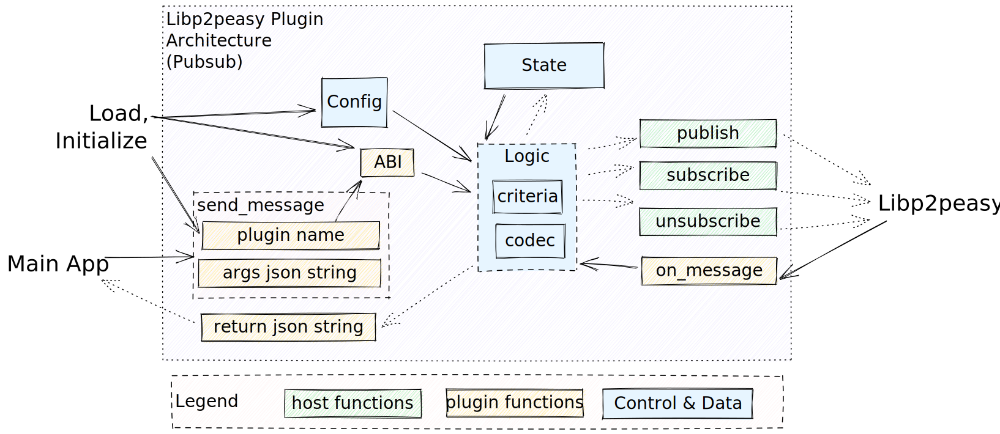

# Plugin Development Kit (PDK) for Libp2p

This repository contains the PDK for Libp2p. It is a collection of libraries and tools that can be used to build Libp2p plugins.

## Demo

[https://douganderson444.github.io/libp2peasy-plugins](https://douganderson444.github.io/libp2peasy-plugins)

Load the [pre-built `wasm` file](dist/ipns-extism/ipns_plugin_bindings.wasm)

## Usage

The [examples] folder will contain examples of how to use the PDK.

YouTube Link:

<!-- Insert Youtub video with thumnail -->

[](https://youtu.be/3hBFgrRNrLk)

1. Enable your libp2p implementation to use the plugin by adding the `loader` to your `on_message` and `on_publish` hooks.

```rust
// when a message is received, iterate through the plugins and pass the message into each plugin
```

```js
// when a message is received, iterate through the plugins and pass the message into each plugin
```

## Plugins

### IPNS

The plugin does two things:

1. `on_message`, it listens for any pubsub messages that match the IPNS topic and stores them in the browser's local storage.
2. `on_publish`, it encodes the record in IPNS and publishes it to the IPNS topic.

## Frontend - See the Demo in Action!

```sh
cd frontend
npm install
npm run dev
```

## Architecture / Spec

[](frontend/static/architecture.svg)

## Build Rust Workspace

`cargo build --workspace`

## Build Indidivual Plugin(s)

Run the batch file:

`./build_dist.bat`

## Run the Example Plugin Use (in Rust)

`cargo run --example ipns_wit`

## Run the Example Plugin Use (in JS)

TODO: But the js bindings are in `dist/ipns-wit/js`
